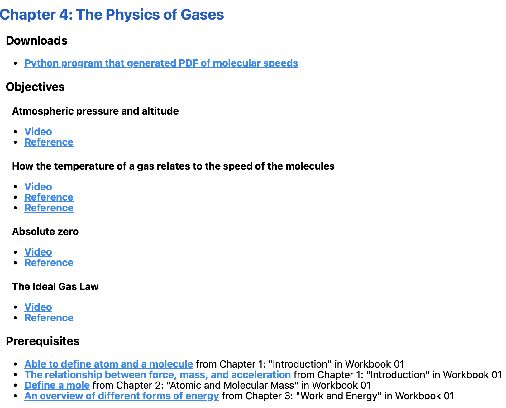

=================
Digital Resources
=================

You can think of each chapter as made up of several learning
objectives.  The sequence, then, is a directed graph -- each chapter
covers some objectives and relies upon some prerequisite objectives.

Each of these objectives gets a short unique ID like "atmos" might represent
the objective of having the student understand the idea of atmospheric pressure.

Besides an ID, each objective gets:

* A description: "Atmospheric pressure and altitude" (required)
* Some online video links (optional)
* Some online reference links.

Besides a list of objectives that a chapter supplies and the list of objectives that
are prerequisites,  the chapter can have some files the student can use.  For example, maybe
a python program that the student can download and run.

===================
gather_resources.py
===================

In the Build directory, there is a python program called ``gather_resources.py``

This program walks the chapter directories, parsing each ``digital_resources.json`` and
creating a web page for each book. Here, for example, is the section for "The Physics of Gases":

It is run as you would expect from inside the ``Build directory``::

    python3 gather_resources.py

======================
digital_resources.json
======================

Here is an example of ``digital_resources.json`` file for a chapter::

    {
    "files": [
    {
      "path": "ar_plot.py",
      "desc": "Python program that generated PDF of molecular speeds"
    }
      ],
        "requires": [
        "atom",
        "fma",
        "mole",
        "energy-forms"
      ],
     "covers": [
        {
          "id": "atmos",
         "desc": "Atmospheric pressure and altitude",
          "videos": [
            "https://youtu.be/xJHJsA7bYGc?si=-GvNXz-qVjSrAIhd"
          ],
          "references": [
            "https://en.wikipedia.org/wiki/Atmospheric_pressure"
          ]
        },
        {
          "id": "gas-temp",
          "desc": "How the temperature of a gas relates to the speed of the molecules",
          "videos": [
            "https://youtu.be/1S9cuYascPQ?si=-3l1h9QrUsXhvhZC"
          ],
         "references": [
           "https://chem.libretexts.org/Bookshelves/Physical_and_Theoretical_Chemistry_Textbook_Maps/Map%3A_Physical_Chemistry_for_the_Biosciences_(Chang)/02%3A_Properties_of_Gases/2.06%3A_Kinetic_Theory_of_Gases",
            "https://en.wikipedia.org/wiki/Kinetic_theory_of_gases"
          ]
        },
        {
          "id": "abs-zero",
          "desc": "Absolute zero",
          "videos": [
           "https://youtu.be/TNUDBdv3jWI?si=KCVL8xng5c-vvzbb"
          ],
          "references": [
            "https://en.wikipedia.org/wiki/Absolute_zero"
          ]
        },
        {
          "id": "ideal-gas-law",
          "desc": "The Ideal Gas Law",
          "videos": [
            "https://youtu.be/qObcdZj8YTM?si=KqJZqU7QSIuc91ol"
          ],
          "references": [
           "https://en.wikipedia.org/wiki/Ideal_gas_law"
          ]
        }
      ]
    }

The structure makes sense, right?  Yes, but it is a real hassle to try to type it, and 
every chapter needs one. So...

==================
resource_wizard.py
==================

We created a python script that you run from the chapter directory.
It asks you questions, and you answer.  And then it generates the JSON
file and saves it in the current directory.

When it runs, it looks like this::

    > python3 ../../../Build/resource_wizard.py
    *** Downloads ***
    Path to download file (relative to CWD) 1:ar_plot.py
    Description of download file 1:Python program that generated PDF of molecular speeds
    Path to download file (relative to CWD) 2:
    *** Prerequisite modules ***
        Prerequisite module identifiers, comma-separated: atom,fma,mole,energy-forms
    atom: "Able to define atom and a molecule"
    fma: "The relationship between force, mass, and acceleration"
    mole: "Define a mole"
    energy-forms: "An overview of different forms of energy"
        Confirmation: y
    *** Covered learning objectives ***
    Objective module identifier 1:atmos
    Objective module description 1:Atmospheric pressure and altitude
    Objective module video URLs, comma-separated 1:https://youtu.be/xJHJsA7bYGc?si=-GvNXz-qVjSrAIhd
    Objective module reference URLs, comma-separated 1:https://en.wikipedia.org/wiki/Atmospheric_pressure
    Objective module identifier 2:gas-temp
    Objective module description 2:How the temperature of a gas relates to the speed of the molecules
    Objective module video URLs, comma-separated 2:https://youtu.be/1S9cuYascPQ?si=-3l1h9QrUsXhvhZC
    Objective module reference URLs, comma-separated 2:https://chem.libretexts.org/Bookshelves/Physical_and_Theoretical_Chemistry_Textbook_Maps/Map%3A_Physical_Chemistry_for_the_Biosciences_(Chang)/02%3A_Properties_of_Gases/2.06%3A_Kinetic_Theory_of_Gases,https://en.wikipedia.org/wiki/Kinetic_theory_of_gases
    Objective module identifier 3:abs-zero
    Objective module description 3:Absolute zero
    Objective module video URLs, comma-separated 3:https://youtu.be/TNUDBdv3jWI?si=KCVL8xng5c-vvzbb
    Objective module reference URLs, comma-separated 3:https://en.wikipedia.org/wiki/Absolute_zero
    Objective module identifier 4:ideal-gas-law
    Objective module description 4:The Ideal Gas Law
    Objective module video URLs, comma-separated 4:https://youtu.be/qObcdZj8YTM?si=KqJZqU7QSIuc91ol
    Objective module reference URLs, comma-separated 4:https://en.wikipedia.org/wiki/Ideal_gas_law
    Objective module identifier 5:
    Preparing to fill digital_resources.json with 
    {
      "files": [
        {
          "path": "ar_plot.py",
          "desc": "Python program that generated PDF of molecular speeds"
        }
      ],
      "requires": [
        "atom",
        "fma",
        "mole",
        "energy-forms"
      ],
      "covers": [
        {
          "id": "atmos",
          "desc": "Atmospheric pressure and altitude",
          "videos": [
            "https://youtu.be/xJHJsA7bYGc?si=-GvNXz-qVjSrAIhd"
          ],
          "references": [
            "https://en.wikipedia.org/wiki/Atmospheric_pressure"
          ]
        },
        {
          "id": "gas-temp",
          "desc": "How the temperature of a gas relates to the speed of the molecules",
          "videos": [
            "https://youtu.be/1S9cuYascPQ?si=-3l1h9QrUsXhvhZC"
          ],
          "references": [
            "https://chem.libretexts.org/Bookshelves/Physical_and_Theoretical_Chemistry_Textbook_Maps/Map%3A_Physical_Chemistry_for_the_Biosciences_(Chang)/02%3A_Properties_of_Gases/2.06%3A_Kinetic_Theory_of_Gases",
            "https://en.wikipedia.org/wiki/Kinetic_theory_of_gases"
          ]
        },
        {
          "id": "abs-zero",
          "desc": "Absolute zero",
          "videos": [
            "https://youtu.be/TNUDBdv3jWI?si=KCVL8xng5c-vvzbb"
          ],
          "references": [
            "https://en.wikipedia.org/wiki/Absolute_zero"
          ]
        },
        {
          "id": "ideal-gas-law",
          "desc": "The Ideal Gas Law",
          "videos": [
            "https://youtu.be/qObcdZj8YTM?si=KqJZqU7QSIuc91ol"      
          ],
          "references": [
            "https://en.wikipedia.org/wiki/Ideal_gas_law"
          ]
        }
      ]
    }
    Type 'y' to confirm:y
    Wrote digital_resources.json

This wizard is not particularly friendly, and it is way annoying that when you make a mistake because there
is no way to go back.  That said,  if you run it a second time, it should prompt you with the old value.

(If a programmer would like to take on making this friendlier, a lot of authors would be very grateful.)

===================
make_topic_index.py
===================

Notice that the wizard knows which objectives have already been created.  When prompted::

    Prerequisite module identifiers, comma-separated: 

you type in ``atom,fma,mole,energy-forms``.  It responds::

    atom: "Able to define atom and a molecule"
    fma: "The relationship between force, mass, and acceleration"
    mole: "Define a mole"
    energy-forms: "An overview of different forms of energy"

It looks those up in ``Chapters/topic_index.json``.  That is updated using the
``make_topic_index.py`` python program::

    python3 make_topic_index.py

